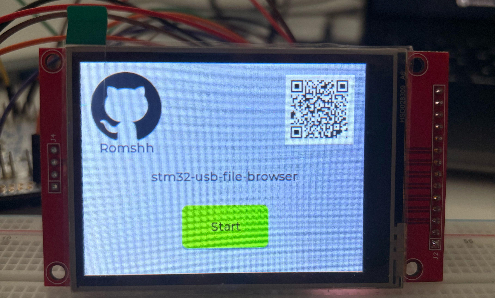
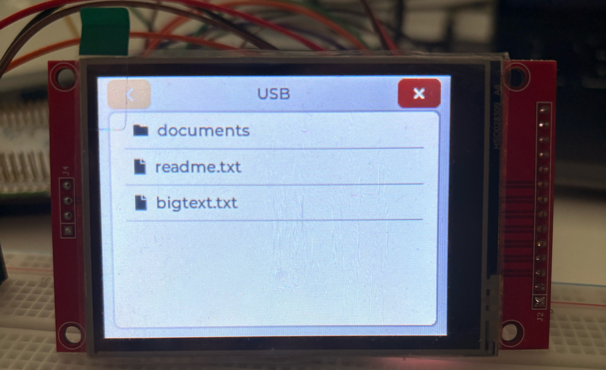
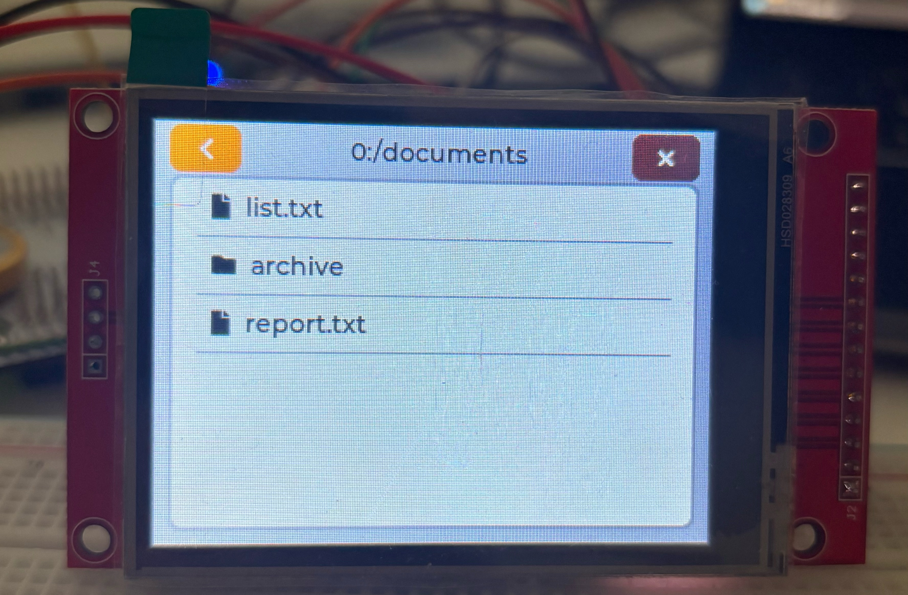
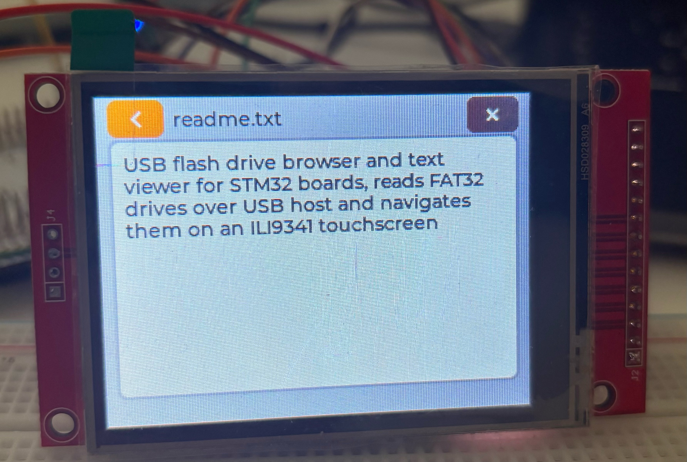

# stm32-usb-file-browser

A touchscreen file browser for USB flash drives, running bare-metal on an
STM32F767ZI. Plug a USB stick into the board, browse its folders on a 2.8 inch
display, and read text files without a PC.

I built this during a summer internship to learn how USB host, FAT and touch
input fit together on a bare-metal MCU.



## Features

- Reads FAT32 drives over USB_OTG_FS as a USB Mass Storage host.
- Pull the drive out and the app goes back to the waiting screen. Plug it back
  in and the list fills by itself.
- Tap a folder to enter it. The back button goes up one level.
- Tap a file to open it. The viewer shows the first 4 KB and you can scroll it.
- The touch panel is the only input, so you do not need any buttons.
- The root screen shows the drive's own volume label.
- Windows and macOS put their own system folders on the drive. Those stay out
  of the list.
- Long file names work, not just the old 8.3 names.

## Screens

At the root the title bar shows the volume label. The back button is greyed
out because there is nothing above the root.



Inside a folder the title bar switches to the full path and the back button
becomes active.



Tapping a file opens it and shows the first 4 KB.



## Hardware

| Part | Model |
|---|---|
| Board | NUCLEO-F767ZI (STM32F767ZIT6U, Cortex-M7) |
| Display | 2.8 inch TFT SPI 240x320, ILI9341 controller |
| Touch | XPT2046, shares the display's SPI bus |
| Storage | Any USB flash drive formatted FAT32 |
| Cable | USB OTG adapter (board side is micro-USB) |

The display module has no on-board regulator. Power it from 3.3 V only.

### Wiring

The display connects to SPI1. Touch shares the same bus with a separate
chip-select line.

| Display module | MCU pin | Purpose |
|---|---|---|
| `VCC` | +3V3 | power |
| `GND` | GND | ground |
| `LED` | +3V3 | backlight, nothing is visible without it |
| `SCK` | `PA5` | SPI1 clock |
| `MOSI` | `PB5` | SPI1 data out |
| `MISO` | `PB4` | SPI1 data in, touch only |
| `CS` | `PA4` | display chip select |
| `DC` | `PA6` | data / command select |
| `RESET` | `PB6` | hardware reset, do **not** tie this to VCC |
| `T_CS` | `PC7` | touch chip select |

The USB VBUS power switch is on `PG6`, active high.

USART3 is set up for the on-board ST-LINK virtual COM port at 9600 baud. The
firmware does not print anything, but the port is there if you want to add your
own output.

Pin assignments live in [`Core/Inc/lcd_conf.h`](Core/Inc/lcd_conf.h) and
[`Core/Inc/touch_conf.h`](Core/Inc/touch_conf.h). Change them there, not in
the driver sources.

## Building

### Toolchain

- STM32CubeIDE 2.2.0 (arm-none-eabi-gcc 14.3, C17)
- STM32CubeMX 6.18.1, needed only to regenerate the peripheral configuration
- STM32Cube FW_F7 V1.17.4

### Dependencies

LVGL and TinyUSB are not in this repo. Download them yourself and unpack them
into the repo root before you build.

| Library | Version | Where to put it |
|---|---|---|
| [LVGL](https://github.com/lvgl/lvgl) | v9.5.0 | `lvgl/` |
| [TinyUSB](https://github.com/hathach/tinyusb) | 0.21.0 | `tinyusb/` |

```
stm32-usb-file-browser/
├── Core/
├── Drivers/
├── fatfs/          <- included, FatFS R0.16
├── lvgl/           <- add this
├── tinyusb/        <- add this
└── lv_conf.h
```

Three config files in this repo are already set up for this project. Do not
overwrite them with the ones that come with the libraries:

- `lv_conf.h` (repo root)
- `Core/Inc/tusb_config.h`
- `fatfs/ffconf.h`

FatFS R0.16 is already in the repo, so you do not need to download it.

### Steps

1. Clone the repository.
2. Download LVGL v9.5.0 and TinyUSB 0.21.0 and unpack them into `lvgl/` and
   `tinyusb/`.
3. In STM32CubeIDE, use `File > Open Projects from File System` and select the
   cloned folder.
4. Build, then flash over the board's built-in ST-LINK.

## How it works

There are four layers. No layer knows anything about the one above it:

```
      LVGL  +  EEZ Studio generated UI
        |
   FatFS R0.16          <- f_opendir / f_readdir / f_open / f_read
        |
   Core/Src/diskio.c    <- bridge: turns FatFS block requests into USB reads
        |
   TinyUSB MSC host     <- tuh_msc_read10
```

FatFS wants a `disk_read()` that is finished by the time it returns. TinyUSB
does not work like that. `tuh_msc_read10()` only puts the command in a queue
and returns right away.

`diskio.c` sits between the two. It sets a flag and waits until the completion
callback clears it. The wait loop calls `tuh_task()` on every turn. Without
that call the USB stack never runs, so the flag never changes and the board
hangs.

The display driver (`lcd.c`) and the touch driver (`touch.c`) do not know that
LVGL exists. LVGL only asks for three things: output, tick and input. That is
why I could plug both drivers in without changing a line inside them.

## Limitations

- Text files only. The viewer replaces every non-printable byte with a dot, so
  an image or a binary opens as a screen of dots instead of corrupting the
  display.
- The app only reads the first 4 KB of a file. Pulling a multi-megabyte log
  into RAM would freeze the board for seconds.
- Read-only. There is no delete, rename or copy.
- Single partition, volume `0:` only. exFAT is turned on in the FatFS config,
  but I never tested it. I only tried FAT32 drives.
- The app draws file names as ASCII. The OEM code page is 437, so accented
  and non-Latin characters get dropped.
- The USB mount and unmount callbacks do filesystem work while the USB task is
  still running. It works, but I know the main loop is the right place for it.

## License

MIT
